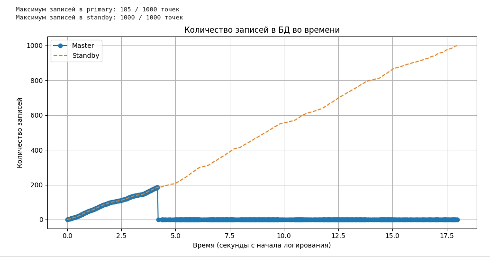

## Настраиваем окружение
Генерировать нагрузку и отслеживать количество записей в БД будет pytho script [jupyter notebook](./lab3.ipynb)
```shell
cd 3.DB_load
python3 -m venv venv
source venv/bin/activate
```
```python
pip install psycopg2-binary
pip install matplotlib
pip install jupyter lab
jupyter lab
```

## Python скрипт
состоит из нескольких логических частей:
1) `RecordLogger` - собирает информацию о количестве записей в БД и строит график
2) `ReverseProxy` - записывает переданные данные в `master`, а при потере соединения перенаправляет трафик на `standby`
3) Основной цикл - передаёт данные в `ReverseProxy` для записи в БД и вызывает `RecordLogger`


## План
1) Поднимаем кластер БД
```
cd lab2
docker compose up
```
2) Запускаем [python скрипт](./db_load.ipynb)
3) Во время работы скрипта убиваем primary командой 
```shell
docker stop master_server
```
4) Ожидаем завершения работы программы и построения графика

## Итоги
При автоматизированном `promote` сложно потерять данные т.к. само нагрузочное приложение выполняет роль прокси, который мониторить жизненный цикл БД и новый запрос сразу попадает в `standby`. Однако это теоретически возможно т.к. `standby` может содержать не все данные `master`



